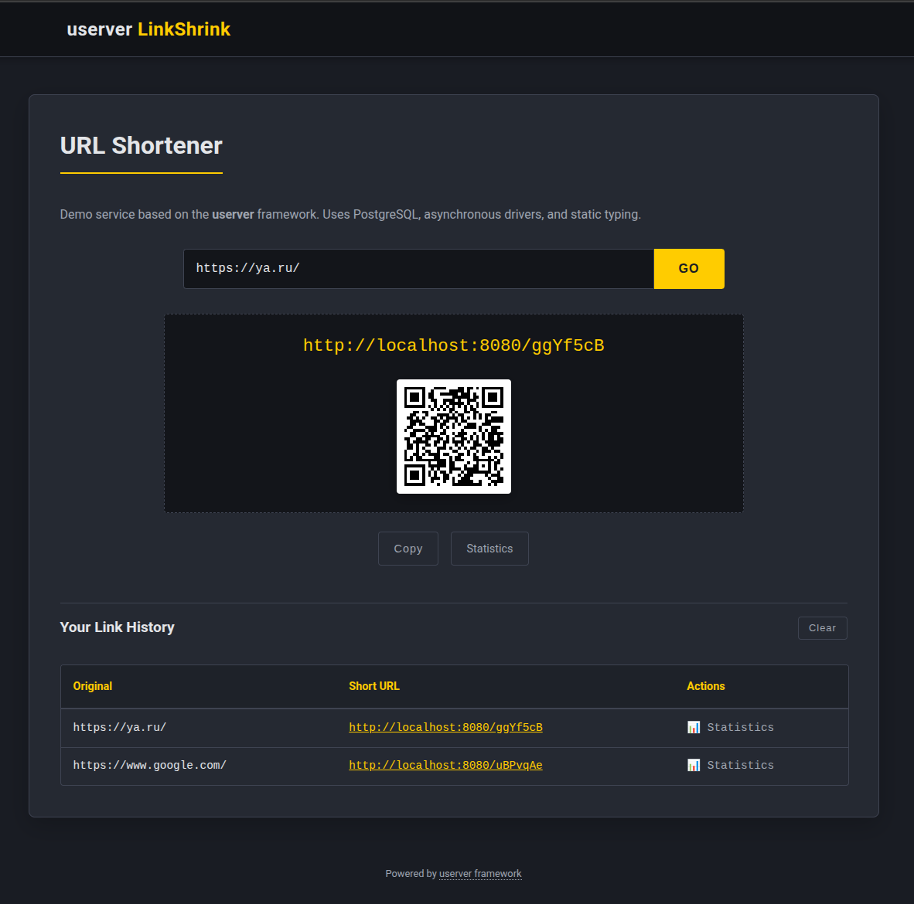
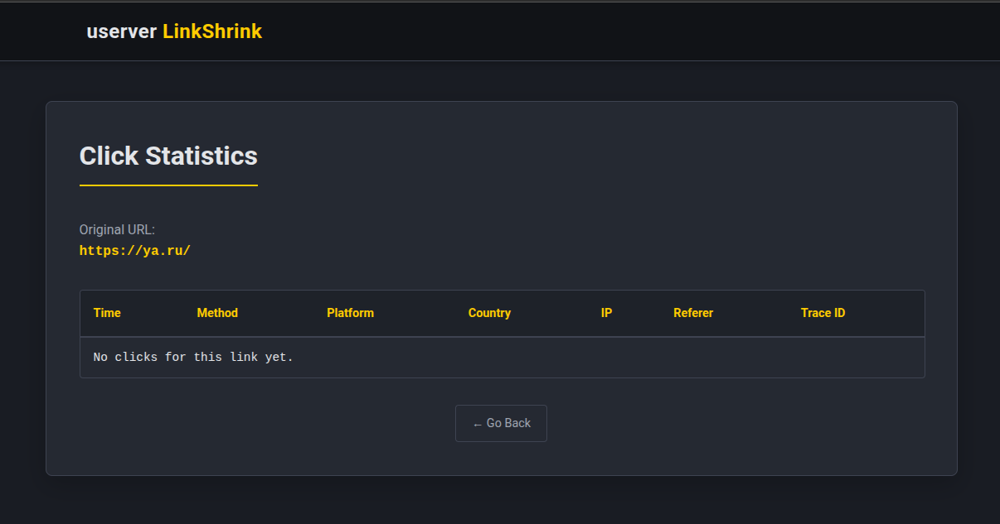

***

# LinkShrink

LinkShrink is a URL shortening service built with C++ using the [userver framework](https://userver.tech/). It demonstrates the implementation of an asynchronous microservice with PostgreSQL integration, in-memory caching, and static typing.

## Web Interface

The service includes a static HTML frontend served directly by the C++ application via the `fs-cache-component`.

*   **Access:** Open `http://localhost:8080/` in a web browser.
*   **Functionality:**
    *   **Shortening:** Input a target URL to generate a short code. The interface displays the result along with a client-side generated QR code.
    *   **History:** The application uses the browser's `localStorage` to persist a history of the last 10 generated links, allowing data recovery across page reloads.
    *   **Statistics:** Click analytics can be accessed via the "Statistics" button in the history table or by navigating directly to `/static/stats.html?code={short_code}`.
  



## Features

*   **URL Shortening:** Generates unique 7-character alphanumeric codes with collision handling.
*   **Redirection:** High-performance redirection using an in-memory LRU cache with a PostgreSQL fallback.
*   **Statistics:** Tracks click data including timestamp, IP address, User-Agent, Referer, and GeoIP (via headers).
*   **Frontend:** Includes a static web interface for generating links, viewing history (local storage), and generating QR codes.
*   **Architecture:**
    *   **Asynchronous I/O:** Uses userver's coroutine engine for non-blocking database and network operations.
    *   **Write Batching:** Click statistics are buffered in memory and written to the database in batches to reduce I/O overhead.
    *   **Read/Write Separation:** Configured to support Master/Slave database replication (logic implemented in handlers).

## Technology Stack

*   **Language:** C++17
*   **Framework:** userver (Yandex)
*   **Database:** PostgreSQL 16
*   **Build System:** CMake
*   **Containerization:** Docker (Multi-stage builds)
*   **Frontend:** HTML5, CSS3, Vanilla JavaScript

## Project Structure

```text
.
├── configs/                # Service configurations (static_config.yaml, config_vars.yaml)
├── postgresql/             # Database schemas and migration data
├── src/                    # C++ Source code
│   ├── handlers/           # HTTP Handlers (Shorten, Redirect, Stats)
│   ├── models/             # Data structures
│   ├── storage/            # Database interaction and accumulators
│   └── utils/              # Utility functions (Short code generation)
├── static/                 # Frontend assets (HTML, CSS, JS)
├── tests/                  # Functional tests (pytest + testsuite)
├── CMakeLists.txt          # Build configuration
├── Dockerfile              # Multi-stage Docker build definition
└── docker-compose.yml      # Container orchestration
```

## Prerequisites

*   **Docker** and **Docker Compose**
*   **VS Code** with the *Dev Containers* extension (recommended for development)

## Getting Started

### 1. Production Deployment

The project uses a multi-stage Dockerfile to produce a minimal runtime image (~150 MB) containing only the necessary binary and runtime dependencies.

To build and run the service:

```bash
docker compose up -d --build
```

The service will be available at `http://localhost:8080`.

*   **Frontend:** Open `http://localhost:8080` in your browser.
*   **Health Check:** `http://localhost:8080/ping`

### 2. Development Environment

This repository is configured for VS Code Dev Containers. This ensures a consistent development environment with all C++ toolchains, CMake, and userver dependencies pre-installed.

1.  Open the project folder in VS Code.
2.  When prompted, click **"Reopen in Container"** (or press `F1` and select *Dev Containers: Reopen in Container*).
3.  VS Code will build the development container (this may take a few minutes on the first run).

Once inside the container, you can build and run the application manually:

```bash
# Configure
cmake -B build -S . -DCMAKE_BUILD_TYPE=Debug

# Build
cmake --build build -- -j$(nproc)

# Run
./build/linkshrink-app --config configs/static_config.yaml --config_vars configs/config_vars.yaml
```

### 3. Running Tests

Functional tests are implemented using `pytest` and `userver-testsuite`. They require the service to be built first.

Inside the Dev Container:

```bash
# Run all tests
pytest tests/
```

## Configuration

The service is configured via YAML files located in the `configs/` directory.

*   **`static_config.yaml`**: Defines the static components of the service (logger, task processors, database components).
*   **`config_vars.yaml`**: Contains runtime variables such as database connection strings and port numbers.

Environment variables in `docker-compose.yml` override specific values in `config_vars.yaml`.

## API Reference

### POST `/shorten`
Creates a short link.

**Request:**
```json
{
  "url": "https://example.com/long/path"
}
```

**Response:**
```json
{
  "short_url": "http://localhost:8080/AbCd123"
}
```

### GET `/{short_code}`
Redirects to the original URL. Returns `302 Found`.

### GET `/stats/{short_code}`
Retrieves click statistics for a specific link.

**Response:**
```json
{
  "original_url": "https://example.com/long/path",
  "clicks": [
    {
      "timestamp": "2023-10-27T10:00:00Z",
      "ip_address": "192.168.1.1",
      "user_agent": "Mozilla/5.0...",
      "http_method": "GET",
      "platform": "Windows",
      "is_mobile": false,
      "country_code": "US"
    }
  ]
}
```

## Database Schema

The database consists of two main tables:

1.  **`urls`**: Stores the mapping between the short code and the original URL.
2.  **`clicks`**: Stores analytical data for every redirect event. Linked to `urls` via a foreign key.

See `postgresql/schemas/01-init.sql` for the DDL.